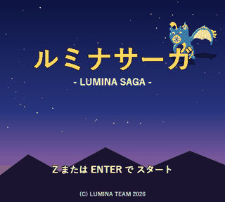
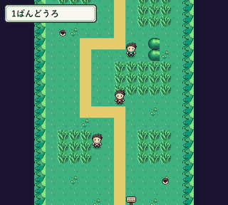
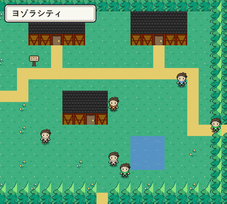
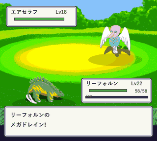
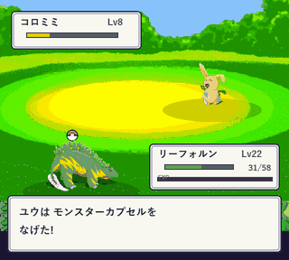
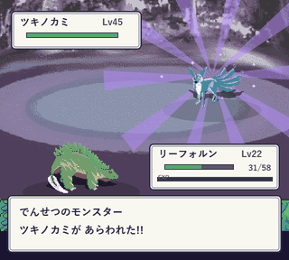
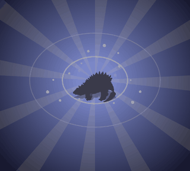
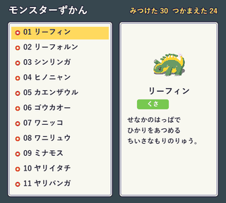

# ルミナサーガ — LUMINA SAGA

**ブラウザだけで動く、本格モンスター収集RPG**
HTML5 Canvas + Vanilla JavaScript / 依存ライブラリ ゼロ / ビルド不要

`index.html` をダブルクリックするだけで起動。サーバーもビルドも要りません。

---

## 何を作ったか / 目的・背景

最新の生成AIで、どのレベルのゲームが作れるのか——という純粋な好奇心から、半ばバイブコーディングで作ったポケモン風RPGです。

作者は普段の研究で Python / C / CUDA を主に使っており、**JavaScript の知識がほぼない状態**からのスタートでした。それでもブラウザだけで動く収集・対戦RPGまで形にできたことが、このプロジェクトの意義です。

| 項目 | 内容 |
|:---|:---|
| 使用モデル / ツール | Claude Fable 5、Claude Code（開発エージェント） |
| 実装 | HTML5 Canvas + Vanilla JavaScript（フレームワーク・エンジン不使用） |
| 規模 | モンスター35種 / エリア27 / BGM10曲 / コード約6,700行 / 依存0 |

※ Claude Fable 5 は米国以外で公開制限が入ったため、集中して触れたのはおおよそ3日程度。その後は弱いモデルでの調整を試みたが思うようにいかず、強いモデルの再公開を待っている。

---

## 自身が担当した役割

コードを手で書き下ろしたわけではありません。担ったのは次です。

1. **要件と遊びの設計** — 何を作るか、どこまでやるか、どんな体験にしたいかを決める
2. **エージェント分担の指示** — 作り始めのプロンプトで、サブエージェント／役割分担（いわゆる ultracode 的な分業）をAIに組ませて並行開発させた（※工程ごとの「担当表」はこの指示の工夫であり、人間が各工程を実装した記録ではない）
3. **プレイ評価とデバッグ指示** — AIの出力を実際に遊び、「動くが微妙」「指示していないところまで作っている」を見つけて直させる
4. **素材・世界観の品質判断** — 低品質な生成画像を却下し、参照素材を選んでAIに名前・技構成を考えさせた
5. **バランス調整** — 成長速度・移動・レア出現・隠し要素など、楽しさの軸を人間側で決めて指示した

---

## 直面した課題と解決方法（人間側の課題）

ここでの課題は「AIが内部で困ったこと」ではなく、**指示する側として自分がぶつかった品質・遊び・制御の問題**です。

| 課題 | 解決 |
|:---|:---|
| AIが頼んでいない範囲まで勝手に作り進める | スコープを切り直して指示し直し、必要なところだけ直させた |
| キャラの切り抜きが甘い／背景と同化して見づらい | 見た目の基準を自分で判断し、AIに修正を指示 |
| Claude単体のキャラデザインが低品質 | 無料のローカルAIで画像生成も試したが品質不足 → [Studio Shimazu の投稿](https://studioshimazu.com/post-618/) を参考にキャラ素材を導入し、**画像を見ながら**名前・技構成を考えさせるよう指示 |
| レベル上げが遅い／移動速度が遅い | ダッシュや成長ペースを調整するよう指示 |
| 移動が逆方向になるムーンウォーク不具合 | 現象を具体的に伝えて修正指示 |
| 通常モンスターだけだと遊び心が足りない | 低確率のレア出現、伝説モンスターの隠しステージを追加指示 |
| 難易度の深さ | 最短おおよそ1時間でクリア可能にしつつ、レア・伝説収集でやり込みが出るよう調整指示 |
| Fable 5 制限後、弱いAIでは調整が効きにくい | 無理に押し切らず、強いモデルの再公開を待つ判断 |

**学び:** バイブコーディングでは「指示しただけ」で終わらせず、AIの足りないところを人間がプレイ評価・デバッグし、素材選定やバランスまで含めて改善することが大切だと感じた。

（技術寄りの裏側: `file://` 向けの画像バンドル、マップ到達性の BFS 検証、バトル演出の Promise 連鎖なども実装側に存在するが、上表が本プロジェクトで自分が主に解いた課題である。）

---

## 🎬 実際のプレイ画面

<table>
<tr>
<td align="center"> 🌍 フィールド探索（草むらのルート）</td>
<td align="center"> 🌃 街の探索（ヨゾラシティ）</td>
</tr>
<tr>
<td align="center"> ⚔️ ターン制バトル（こうかはばつぐん）</td>
<td align="center"> 🎯 捕獲（カプセルでなかまに）</td>
</tr>
<tr>
<td align="center"> 🌟 でんせつバトル（オーラ演出）</td>
<td align="center"> ✨ しんか！</td>
</tr>
<tr>
<td align="center"> 📖 モンスターずかん</td>
<td align="center"> 🎮 タイトル画面</td>
</tr>
</table>

---

## 🕹️ 遊び方

`index.html` をブラウザで開くだけ。

| キー | 操作 |
|:---:|:---|
| <kbd>↑</kbd> <kbd>↓</kbd> <kbd>←</kbd> <kbd>→</kbd> / <kbd>W</kbd><kbd>A</kbd><kbd>S</kbd><kbd>D</kbd> | 移動・カーソル |
| <kbd>Z</kbd> / <kbd>Space</kbd> | けってい・はなす・しらべる |
| <kbd>X</kbd> / <kbd>Esc</kbd> | キャンセル（ホールドでダッシュ） |
| <kbd>Enter</kbd> | メニュー / スタート |

---

## 🧩 ゲーム内容

- 🐉 **モンスター 35種** — 2段・3段進化ラインを含む
- 🗺️ **ワールドマップ 27エリア** — 村・街・どうくつ・みずうみ・もり・こうげん
- ⚔️ **戦略的ターン制バトル** — 10タイプの相性表・状態異常・能力ランク変化・急所
- 🏛️ **3つのジム + チャンピオン戦**、ライバル「レン」との計3回の対決
- 🌟 **レア／でんせつのモンスター** — 草むらから低確率で出現、専用の遭遇演出つき
- 🌙 **隠しほこら** — どこかの森に眠る でんせつのモンスターが待つ
- 🎵 **チップチューンBGM 10曲** — WebAudio によるリアルタイム合成（音源ファイル不使用）
- 📖 ずかん・ボックス・ショップ・セーブ（レポート）完備

---

## 🛠️ 技術情報

フレームワークやゲームエンジンを一切使わず、**HTML5 Canvas と Vanilla JavaScript のみ**で構築。`index.html` を開くだけで動作し、サーバー・ビルド・依存ライブラリを必要としない。

| 項目 | 設計 |
|:---|:---|
| **シーン管理** | スタックベース（push / pop / replace）。タイトル・フィールド・バトル・メニューを階層切替 |
| **バトルエンジン** | 演出ステップを **Promise チェーン**で連結する非同期スクリプト。描画ループとロジックを分離 |
| **サウンド** | WebAudio API で矩形波×2・三角波・ノイズをリアルタイム合成（音源ファイル不使用） |
| **オフライン動作** | 全画像を **Base64 バンドル**し、`file://` の CORS 制約を回避 |
| **品質保証** | `tools/validate.js` がマップの **BFS 到達可能性**・スプライト整合性を検証 |
| **描画** | Canvas 2D。ドット絵向けにスムージング無効化 |
| **規模** | Vanilla JS 約 **6,700 行**（自動生成バンドル除く）、依存 **0** |

---

## 🎨 クレジット

- **モンスター・タイルセット・バトル背景（ドット絵）**
  [Guardian Monsters Artwork](https://creativecommons.org/licenses/by/4.0/) by Georg Eckert / lucidtanooki（CC-BY-4.0 / 利用）

- **キャラクター素材の参考**
  [Studio Shimazu の投稿](https://studioshimazu.com/post-618/) を参考に選定・導入し、AIに画像を見ながら名前・技を設計させた

- **プログラム・ゲームデザイン・データ設計・BGM**
  [Claude Code](https://claude.com/claude-code) / Claude Fable 5 を活用したバイブコーディング。要件・評価・修正指示は作者

ゲーム内エンディングのスタッフロールにもクレジットを表記しています。

---

© LUMINA TEAM 2026 — Art: Guardian Monsters (CC-BY-4.0)

